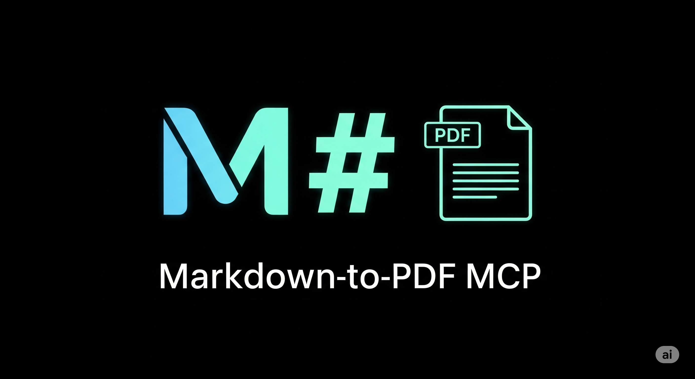

[](https://mseep.ai/app/2b3pro-markdown2pdf-mcp)

# Markdown2PDF MCP Server (markdown2pdf-mcp)

An MCP server for converting Markdown documents to PDF files. This server provides a simple and efficient way to generate PDFs from Markdown content with support for syntax highlighting and custom styling. Also allows for watermarking on page 1.

Inspired by Alan Shaw's [markdown-pdf](https://github.com/alanshaw/markdown-pdf).

## Features

- Convert Markdown to PDF with a single command
- Syntax highlighting for code blocks
- Custom CSS styling for PDF output
- Support for standard Markdown formatting
- Mermaid diagram rendering
- Modern PDF generation using Chrome's rendering engine
- Excellent support for modern web features and fonts
- Reliable resource loading and rendering

## Limitations

The following markdown elements are not supported:

- LaTeX math equations (e.g., `$x^2$` or `$$\sum_{i=1}^n x_i$$`)
- Complex mathematical formulas or scientific notation

Stick to these supported markdown elements:

- Headers (all levels)
- Text formatting (bold, italic, strikethrough)
- Lists (ordered and unordered)
- Code blocks with syntax highlighting
- Tables
- Blockquotes
- Links
- Images (both local files and external URLs)
- Task lists
- Mermaid diagrams

### Mermaid Diagrams

To render a Mermaid diagram, use a `mermaid` code block:

´´´markdown

```mermaid
graph TD;
    A-->B;
    A-->C;
    B-->D;
    C-->D;
```

´´´

If there is a syntax error in your diagram, the error message will be rendered in the PDF, helping you to debug it.

## Installation

```bash
# Clone the repository
git clone https://github.com/2b3pro/markdown2pdf-mcp.git

# Navigate to the project directory
cd markdown2pdf-mcp

# Install dependencies
npm install

# Build the project
npm run build
```

## Usage

### Starting the Server

```bash
npm start
```

### Using the MCP Tool

The server provides a single tool `create_pdf_from_markdown` with the following parameters:

```typescript
{
  // Required parameters
  markdown: string;    // Markdown content to convert

  // Optional parameters with defaults
  outputFilename?: string;  // Filename for the PDF (e.g., "output.pdf")
  paperFormat?: string;     // 'letter' (default), 'a4', 'a3', 'a5', 'legal', 'tabloid'
  paperOrientation?: string; // 'portrait' (default), 'landscape'
  paperBorder?: string;     // '2cm' (default), accepts decimal values with CSS units (e.g., '1.5cm', '2.5mm', '0.5in', '10.5px')
  watermark?: string;       // Optional watermark text (max 15 characters, uppercase)
}
```

Example with options:

```typescript
await use_mcp_tool({
  server_name: "markdown2pdf",
  tool_name: "create_pdf_from_markdown",
  arguments: {
    markdown: "# Hello World\n\nThis is a test document.",
    outputFilename: "output.pdf",
    paperFormat: "a4",
    paperOrientation: "landscape",
    paperBorder: "1.5cm",
    watermark: "DRAFT",
  },
});
```

Example minimal usage:

```typescript
await use_mcp_tool({
  server_name: "markdown2pdf",
  tool_name: "create_pdf_from_markdown",
  arguments: {
    markdown: "# Hello World\n\nThis is a test document.",
    outputFilename: "output.pdf",
  },
});
```

## Configuration

### Output Directory

You can configure the output directory in your MCP settings file for apps that use MCP such as Cline or Claude. If not configured, it will save files to $HOME:

```json
{
  "mcpServers": {
    "markdown2pdf": {
      "command": "node",
      "args": ["path/to/markdown2pdf-mcp/build/index.js"],
      "env": {
        "M2P_OUTPUT_DIR": "/path/to/output/directory"
      }
    }
  }
}
```

The tool automatically handles file name conflicts by appending incremental numbers (e.g., output.pdf, output-1.pdf, output-2.pdf).

## Dependencies

- [@modelcontextprotocol/sdk](https://github.com/modelcontextprotocol/sdk) - MCP SDK for server implementation
- [remarkable](https://github.com/jonschlinkert/remarkable) - Markdown parser
- [highlight.js](https://github.com/highlightjs/highlight.js) - Syntax highlighting
- [puppeteer](https://github.com/puppeteer/puppeteer) - Modern PDF generation using [Chrome for Testing](https://developer.chrome.com/blog/chrome-for-testing/) (v131.0.6778.204)

## Chrome Version

This package uses Chrome v131.0.6778.204 for consistent PDF generation across all installations. This version is automatically installed when you run `npm install`.

- [tmp](https://github.com/raszi/node-tmp) - Temporary file handling

## Development

```bash
# Build the project
npm run build

# Start the server
npm start
```

## License

MIT

## Contributing

1. Fork the repository
2. Create your feature branch (`git checkout -b feature/amazing-feature`)
3. Commit your changes (`git commit -m 'Add some amazing feature'`)
4. Push to the branch (`git push origin feature/amazing-feature`)
5. Open a Pull Request
